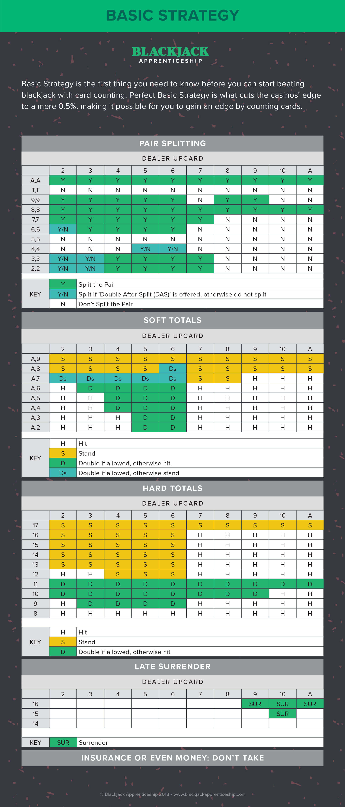

# Black Jack Training Streamlit App

## Contents

1. [Background](#background)
2. [The Strategy](#the-strategy)
3. [Strategy Card](#strategy-card)
4. [Initial Setup](#initial-setup)
5. [Running the App](#running-the-streamlit-app)


## Background

I started this little journey because I've always wanted to learn how to beat the dealer's odds in the casino game BlackJack.  I was expecting to simulate BlackJack games, do some fun data analysis, and try to determine the best strategy to win hands. As it turns out, the strategy has already been researched heavily and the general strategy is for the most part already agreed upon.

I was too far down the rabbit hole and was too excited to stop my little side project, so I made this StreamLit app. The goal is to simulate hands of BlackJack while suggesting to the user which decision to make according to the strategy guidelines. I used the chart from [BlackJack Apprenticeship](https://www.blackjackapprenticeship.com/blackjack-strategy-charts/) to build the suggestion algorithm. 

## The strategy

Conceptually, the strategy is simple. Once delt your first two cards there is a queue of questions you have to answer:

- Do you split?

    If your first two cards have the same value (ie: two 5s, two facecards), you can chose to "split". 

    >If you chose to split, you double your bet and split your hand into two new hands that you play individually. The dealer will split the two cards and then deal one additional card to each hand. You then play out the two hands like normal.

- Do you double?
    
    If you do not want to (or can't) split your first two cards, the next decision to make is whether or not to "Double Down".

    >If you chose to Double, you double the amount you bet at the beginning of the hand and you only receive one more card. Your hand is then over and you have to see if the 3 cards in your hand beat the dealer. 

    Generally, doubling down is done when you have a high confidence that you can beat the dealer with only one more card. 

- Do you hit or stand?

    If you chose not to split or double, your only decision left is whether to "hit" (take another card) or "stand" (end your turn and see if your hand beats the dealer). You can hit as many times as you want to without "busting" (going over 21).

Ok cool... so how do you know when to split or hit or what? The wonderful people at BlackJack Apprenticeship put together this chart to illustrate what to do based on your card total score and the dealer's upcard. I translated this chart to a decision algorithm in [decision_maker.py](/casino/decision_maker.py). The function `player_decision` returns the suggestion so that StreamLit can highlight the correct choice.


## Strategy Card




## Initial Setup

1. Clone this repository and move into the app directory.

    ```shell
    git clone git@github.com:ntbanks/blackjack-streamlit-app.git
    cd blackjack-streamlit-app
    ```

2. Create and activate your virtual environment.

    ```shell
    python3 -m venv env
    source env/bin/activate
    ```

3. Install requirements. Currently just [StreamLit](https://streamlit.io).

    ```shell
    pip install --upgrade pip
    pip install -r app/requirements.txt
    ```

## Running the StreamLit app

To run the StreamLit app, from the root folder of the project run the following command. StreamLit will host the game on your machine at port 8501. You can access in your [browser](localhost:8501).
```shell
streamlit run app/app.py
```
If needed, you can pass StreamLit a different port.
```shell
streamlit run app/app.py --server.port 8000
```
